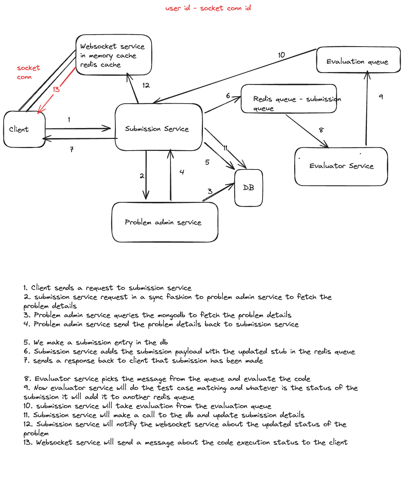
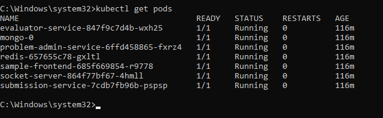

# HackerCamp: Advanced Microservices-based Code Compilation and Execution Platform

HackerCamp is an advanced, highly scalable microservices-based platform for code compilation and execution, designed to function like LeetCode or Codeforces. It provides seamless scalability, high availability, and efficient asynchronous execution with Azure deployment and auto-scaling capabilities.

## Architecture Diagram



## 🚀 Features

### Microservices Architecture & Scalability

- Architected a microservices-based platform ensuring seamless scalability and high availability.
- Deployed on **Azure Kubernetes Service (AKS)** with auto-scaling groups and load balancers for optimal performance and fault tolerance.

### 🛠 Dynamic Problem Administration

- Developed **Problem Admin Service** using **TypeScript, Express, and MongoDB**.
- Manages CRUD operations for coding problems.
- Supports complex test cases and code stubs to facilitate comprehensive evaluation.

### ⚡ Advanced Code Execution

- Implemented an **Executor Service** in **TypeScript and Express**.
- Utilizes **Docker containers** to support JavaScript code execution.

### 🔗 High-performance Asynchronous Communication

- Designed a robust **Submission Service** using **Fastify**.
- Handles a high volume of requests efficiently.
- Integrated **Redis message queues** for asynchronous communication.
- Implemented **WebSocket services** to provide real-time feedback and enhance interactivity.

### ☁️ Azure Deployment & Operational Excellence

- Deployed the entire system on **Azure Kubernetes Service (AKS)**.
- Utilized **auto-scaling**, **load balancers**, and **monitoring tools** for fault tolerance and performance optimization.

## 📌 Technologies Used

- **Backend:** Node.js, Express, Fastify, TypeScript
- **Database:** MongoDB
- **Message Queue:** Redis
- **Containerization:** Docker
- **Orchestration & Deployment:** Kubernetes (AKS)
- **Real-time Communication:** WebSockets
- **Cloud Provider:** Azure

## 📜 Installation & Setup

To run the project locally:

```sh
# Clone the repository
git clone "https://github.com/dev-krishnadeshpande/HackerCamp-Backend.git"
cd HackerCamp-Backend

# Start services (example using Docker Compose, update service names in docker-compose file as per your services)
docker-compose up -d
```

Instructions for AKS setup:

```sh
# Create a resource group using the az group create command.

az group create --name <resource_group_name> --location eastus

# Create an ACR instance using the az acr create command and provide your own unique registry name.

az acr create --resource-group <resource_group_name> --name <acr_name> --sku Basic

# Build and push container images to registry

## Log in to the azure container registry
az acr login --name <acr_name>

az acr build --registry <acr_name> --image hackercamp-backend/problem-admin-service:latest ./HackerCamp-Problem-Admin-Service

az acr build --registry <acr_name> --image hackercamp-backend/submission-service:latest ./HackerCamp-Submission-Service

az acr build --registry <acr_name> --image hackercamp-backend/evaluator-service:latest ./HackerCamp_Evaluator_Service

az acr build --registry <acr_name> --image hackercamp-backend/socket-server:latest ./HackerCamp-Socket-Server

az acr build --registry <acr_name> --image hackercamp-backend/hackercamp-backend-services:latest ./HackerCamp-Frontend

## If your registry pricing tier doesn't support "az acr build", build images using docker locally and then push.

# Problem Admin Service

docker build -t <acr_name>.azurecr.io/hackercamp-backend/problem-admin-service:latest ./HackerCamp-Problem-Admin-Service
docker push <acr_name>.azurecr.io/hackercamp-backend/problem-admin-service:latest

# Submission Service

docker build -t <acr_name>.azurecr.io/hackercamp-backend/submission-service:latest ./HackerCamp-Submission-Service
docker push <acr_name>.azurecr.io/hackercamp-backend/submission-service:latest

# Evaluator Service

docker build -t <acr_name>.azurecr.io/hackercamp-backend/evaluator-service:latest ./HackerCamp_Evaluator_Service
docker push <acr_name>.azurecr.io/hackercamp-backend/evaluator-service:latest

# Socket Server

docker build -t <acr_name>.azurecr.io/hackercamp-backend/socket-server:latest ./HackerCamp-Socket-Server
docker push <acr_name>.azurecr.io/hackercamp-backend/socket-server:latest

# Sample frontend

docker build -t <acr_name>.azurecr.io/hackercamp-backend/sample-frontend:latest ./HackerCamp-Frontend
docker push <acr_name>.azurecr.io/hackercamp-backend/sample-frontend:latest

# Check pushed images in registry
   az acr repository list --name <acr_name> --output table

# Install kubectl locally using the az aks install-cli command.
   az aks install-cli

# Create an AKS cluster
   az aks create --resource-group <resource_group_name> --name hackercampBackendCluster --node-count 2 --generate-ssh-keys --attach-acr <acr_name>

# Connect to cluster using kubectl
   az aks get-credentials --resource-group <resource_group_name> --name <cluster_name>

# Update attached k8s confiuration file as per your reistry names and apply the configs.
   kubectl apply -f hackercamp-backend-aks.yaml

# Check nodes and pods
   kubectl get nodes
   kubectl get pods

   

# Verify the functionality
```

## Upcoming Changes:

- Features such as TLE and MLE for a particular submission.
- Code execution support for languages such as C++, Java, Python.
- Error handling with global error handling middlewares.
- Create generic response structure.
- Integrate with Azure Application Insights for sophisticated logging mechanism.
- Unit tests

🚀 **HackerCamp: Where coding meets performance and scalability!**
