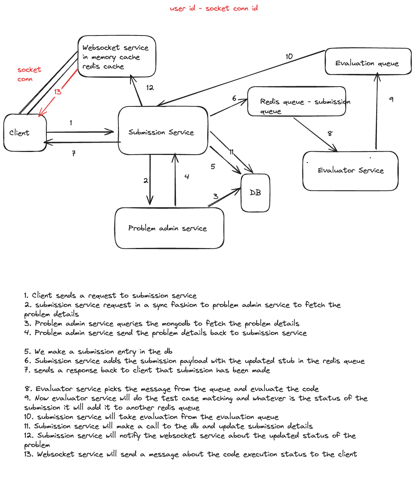

# HackerCamp: Advanced Microservices-based Code Compilation and Execution Platform

HackerCamp is an advanced, highly scalable microservices-based platform for code compilation and execution, designed to function like LeetCode or Codeforces. It provides seamless scalability, high availability, and efficient asynchronous execution with Azure deployment and auto-scaling capabilities.

## Architecture Diagram

## 🚀 Features

### Microservices Architecture & Scalability

- Architected a microservices-based platform ensuring seamless scalability and high availability.
- Deployed on **Azure Kubernetes Service (AKS)** with auto-scaling groups and load balancers for optimal performance and fault tolerance.

### 🛠 Dynamic Problem Administration

- Developed **Problem Admin Service** using **JavaScript, Express, and MongoDB**.
- Manages CRUD operations for coding problems.
- Supports complex test cases and code stubs to facilitate comprehensive evaluation.

### ⚡ Advanced Code Execution

- Implemented an **Executor Service** in **TypeScript and Express**.
- Utilizes **Docker containers** to support JavaScript code execution.

### 🔗 High-performance Asynchronous Communication

- Designed a robust **Submission Service** using **Fastify**.
- Handles a high volume of requests efficiently.
- Integrated **Redis message queues** for asynchronous communication.
- Implemented **WebSocket services** to provide real-time feedback and enhance interactivity.

### ☁️ Azure Deployment & Operational Excellence

- Deployed the entire system on **Azure Kubernetes Service (AKS)**.
- Utilized **auto-scaling**, **load balancers**, and **monitoring tools** for fault tolerance and performance optimization.

## 📌 Technologies Used

- **Backend:** Node.js, Express, Fastify, TypeScript
- **Database:** MongoDB
- **Message Queue:** Redis
- **Containerization:** Docker
- **Orchestration & Deployment:** Kubernetes (AKS)
- **Real-time Communication:** WebSockets
- **Cloud Provider:** Azure

🚀 **HackerCamp: Where coding meets performance and scalability!**
